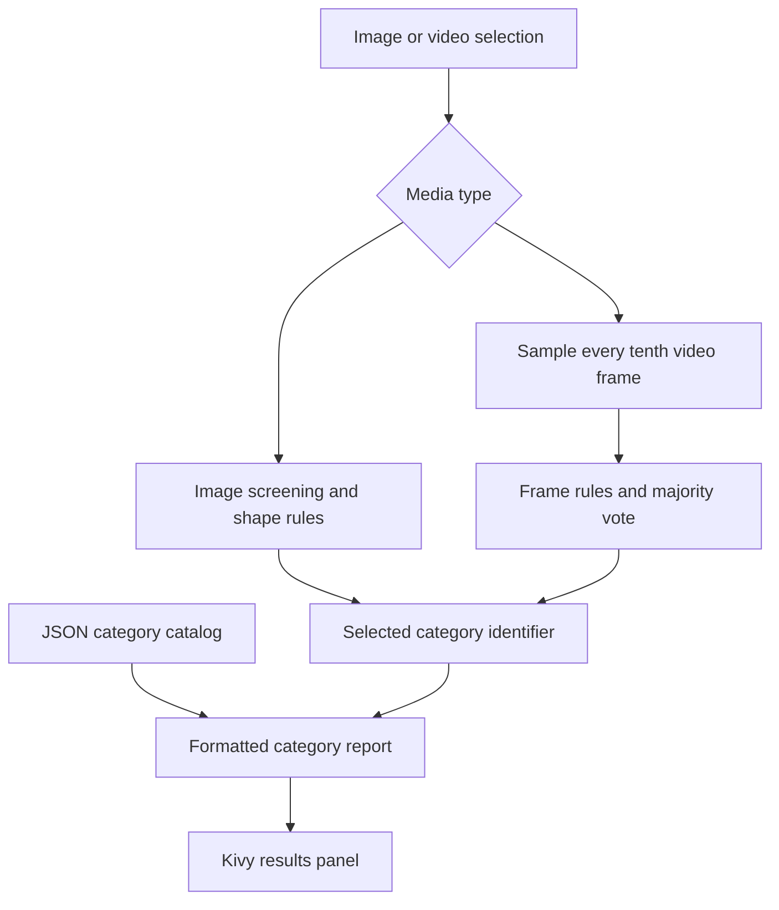

<div align="center">


# Screw Identification & Classification System

### An inspectable computer-vision prototype for fastener image and video analysis


[](LICENSE)

[Overview](#overview) · [Architecture](#architecture) · [Methods](#vision-methods) · [Quick start](#quick-start) · [Data](#data-and-category-catalog) · [Limitations](#limitations-and-validation)

</div>

## Overview

This project explores fastener classification through classical image processing and an interactive desktop interface. Users select or drag in an image or video, run analysis, and inspect a category description drawn from a local JSON catalog.

The primary application combines **OpenCV edge and contour analysis**, **handwritten classification rules**, and a **Kivy interface**. It is useful as an educational prototype for studying image features, decision rules, and desktop application integration. It does not contain a trained fastener recognition model.

| Capability | Current behavior |
|---|---|
| Image input | JPG, JPEG, PNG, BMP, and TIFF |
| Video input | MP4, AVI, MKV, and MOV, subject to installed decoder support |
| Desktop workflow | File chooser, drag and drop, image preview, and analysis results |
| Image screening | Edge-density and contour-geometry checks |
| Category selection | Ordered rules using contour shape and pixel area |
| Video aggregation | Every tenth frame classified; majority category returned |
| Catalog reporting | Category name, descriptive attributes, and typical application |
| Diagnostic output | Image aspect ratio, circularity, contour area, and bounding-box dimensions |

**Interpretation:** material, nominal size, coating, and strength grade are catalog attributes, not measurements inferred from the uploaded image. They must not be used to establish a fastener's engineering suitability.

## Architecture



The image and video paths use different rule sets. Video analysis does not apply the image screening routine to each frame.

## Vision methods

### Image screening

The image is converted to grayscale, blurred with a 5 × 5 Gaussian kernel, and processed with Canny thresholds 30 and 100. Screening uses the largest external contour and these features:

| Feature | Definition | Accepted screening range |
|---|---|---|
| Edge density | Fraction of pixels with a nonzero edge response | 0.005–0.35 |
| Contour area | Area of the largest contour in pixel units | 300–50,000 |
| Circularity | $4\pi A/P^2$, where $A$ is area and $P$ is perimeter | 0.1–1.2 |
| Aspect ratio | Axis-aligned bounding-box width divided by height | 0.2–6.0 |
| Edge variation | Standard deviation divided by mean of row-wise edge sums in the bounding box | At most 2.5 |

Small child contours are counted as a diagnostic for possible thread-like structures. Fewer than two produce a warning but do not reject the image.

These thresholds are implementation choices, not validated universal fastener criteria. Pixel area changes with camera distance and resolution; an axis-aligned aspect ratio changes with orientation.

### Image classification

Images passing screening are processed again using Canny thresholds 50 and 150. An ordered sequence of conditions maps contour area, aspect ratio, circularity, and bounding-box dimensions to a catalog identifier. The fallback is **Wood Screw**, rather than an explicit unknown category.

The catalog has 14 records, but the rule set does not provide 14 independent, validated recognition classes. Some records have no dedicated image branch, and an earlier matching condition can prevent a later branch from being reached.

### Video classification

The video path processes frames at indices 0, 10, 20, and so on:

| Condition | Selected category |
|---|---|
| More than 50 external contours and largest contour area above 10,000 | Long Lag Screw |
| Otherwise, more than 30 contours and area above 5,000 | Lag Wood Screw |
| Otherwise | Wood Screw |

A majority vote selects the final category. There is no object tracking, bounding-box output, probability estimate, or calibrated confidence score. Tied votes have no explicitly defined deterministic policy.

See [the application source](Application_of_screw_detaction/screw_detection_app.py) for the complete execution paths and thresholds.

## Quick start

### Requirements

Use an isolated Python environment and a computer with a graphical display. A Python 3.10 or 3.11 environment is a reasonable starting point; the repository does not currently declare or test a supported Python-version matrix.

The main desktop application imports NumPy, OpenCV, Pillow, Kivy, and scikit-image. Although its local-binary-pattern import is currently unused, scikit-image must be installed for that import to succeed.

### Install and launch

```bash
git clone https://github.com/Foysal-A-Al/Screw-Identification-and-Classification-System.git
cd Screw-Identification-and-Classification-System
python -m venv .venv
```

| Platform | Activate environment |
|---|---|
| Windows PowerShell | `.venv\Scripts\Activate.ps1` |
| Linux / macOS | `source .venv/bin/activate` |

```bash
python -m pip install --upgrade pip
python -m pip install numpy opencv-python pillow kivy scikit-image
cd Application_of_screw_detaction
python screw_detection_app.py
```

Run from **Application_of_screw_detaction** because the application opens `screw_data.json` relative to the current working directory. The directory's original spelling is retained in the commands.

The repository includes a substantial image collection, so cloning may require considerable disk space and download time. There is no packaged CLI, REST service, or Docker deployment in the current repository.

### Desktop workflow

1. Click **Upload File** and select an image or video, or drag a file onto the application window.
2. Check the selected filename and image preview where available.
3. Click **Analyze File**.
4. Inspect the returned category description and, for images, diagnostic geometry.
5. Treat the catalog details as reference text and independently verify the physical item.

Prefer RGB images with one clearly visible fastener, a simple background, good lighting, and consistent framing. This is practical input guidance, not a demonstrated robustness guarantee.

## Data and category catalog

### Application catalog

[screw_data.json](Application_of_screw_detaction/screw_data.json) contains 14 named records:

| ID | Catalog name | ID | Catalog name |
|---|---|---|---|
| 1 | Long Lag Screw | 8 | Bolt |
| 2 | Lag Wood Screw | 9 | Torx Screw |
| 3 | Wood Screw | 10 | Phillips Screw |
| 4 | Short Wood Screw | 11 | Hex Socket Cap Screw |
| 5 | Shiny Screw | 12 | Flat Head Machine Screw |
| 6 | Black Oxide Screw | 13 | Pan Head Sheet Metal Screw |
| 7 | Nut | 14 | Self-Tapping Screw |

Each record stores `name`, `type`, `material`, `size`, `head_type`, `drive_type`, `thread_type`, `strength_grade`, `coating`, `application`, and `description`.

These records are illustrative descriptions. They are not manufacturer-certified specifications or a standards-based fastener database. Adding a JSON record alone does not add a corresponding recognition rule.

### Included MVTec Screws dataset

The [dataset documentation](Application_of_screw_detaction/screwdata/README_v1.0.txt) describes **384 images**, **13 object types**, and **4,426 oriented-box annotations**, with supplied training, validation, and test splits.

The images and annotations reside in [screwdata](Application_of_screw_detaction/screwdata). The desktop application does not load these annotation files, train on these splits, or report benchmark results against them. The dataset's categories and the application's 14-record catalog must not be assumed to share a verified one-to-one mapping.

**Dataset license:** MVTec images and annotations are distributed under **CC BY-NC-SA 4.0**, separately from this repository's MIT code license. Follow the included dataset notice for attribution, sharing conditions, and commercial-use inquiries.

The dataset notice requests citation of:

> Markus Ulrich, Patrick Follmann, and Jan-Hendrik Neudeck. *A comparison of shape-based matching with deep-learning-based object detection.* Technisches Messen, 2019. DOI: 10.1515/teme-2019-0076.

## Repository guide

| Resource | Purpose |
|---|---|
| [Desktop application](Application_of_screw_detaction/screw_detection_app.py) | Kivy interface, image screening, classification, and video aggregation |
| [Category catalog](Application_of_screw_detaction/screw_data.json) | Descriptive metadata for 14 records |
| [Functional tests](Application_of_screw_detaction/Functional_Test) | Legacy test utilities and fixtures |
| [Dataset and annotations](Application_of_screw_detaction/screwdata) | MVTec image collection and supplied annotations |
| [Buildozer configuration](Application_of_screw_detaction/buildozer.spec) | Experimental mobile-packaging configuration |
| [Project report (PDF)](Screw%20Detection%20System_Name_Abdullah%20Al%20Foysal_id_S5507472.pdf) | Accompanying project report |

The legacy Colab script is retained under `Application_of_screw_detaction`. The desktop application above is the documented entry point; the repository does not contain the notebook and helper modules described in the former README.

## Limitations and validation

The current project should be evaluated as a **classical-vision prototype**:

- Recognition rules are sensitive to lighting, background texture, scale, orientation, and image composition.
- Classification uses the largest contour rather than separating and identifying every object in a scene.
- A fallback label can produce a category even when evidence is weak; there is no calibrated uncertainty or complete unknown-object rejection.
- The image loading path assumes RGB-like input; grayscale and transparency handling need explicit normalization.
- Video analysis runs synchronously and can block the desktop interface while processing.
- Catalog descriptions cannot establish measured dimensions, alloy, coating, strength grade, or safe load capacity.

### Existing tests

The legacy test files do not currently establish recognition accuracy for the main application. Several contain machine-specific Windows paths; some exercise a separate contour-count helper, and the 14-category test simulates the category identifier rather than invoking the desktop classifier.

No portable CI workflow, held-out confusion matrix, precision/recall report, or validated accuracy figure is provided. This README update checks the documentation against the source; it does not claim that the GUI or legacy suite has passed runtime verification.

### Troubleshooting

| Symptom | Action |
|---|---|
| `screw_data.json` not found | Launch from `Application_of_screw_detaction` and confirm the JSON file is present |
| Missing `skimage` module | Install `scikit-image` in the active environment |
| Kivy cannot create a window | Check display access and graphics/backend support; this is a desktop application |
| Video cannot be opened | Verify the path and codec support in the installed OpenCV build |
| Unexpected category | Inspect the input framing and rule thresholds; the result is heuristic |
| Tests fail during collection | Inspect the legacy absolute paths and helper imports before running the suite |

The Buildozer configuration is experimental: it references a `main.py` entry point and icon/presplash assets that are not present at the configured locations, and it omits the application's scikit-image dependency. A validated Android build is not currently documented.

## Development priorities

Potential improvements, **not current capabilities**, include:

1. Normalize image modes and resolve resource paths relative to the source file.
2. Separate the analysis engine from the interface and replace legacy tests with portable regression checks.
3. Define category mappings and evaluate a labeled, held-out benchmark.
4. Add explicit unknown-object handling and deterministic video aggregation.
5. Compare scale- and rotation-aware classical methods with trained detection models under the dataset's license conditions.

Contributions should identify the specific failure case, provide a reproducible input where permitted, and include validation appropriate to the change. Use [GitHub issues](https://github.com/Foysal-A-Al/Screw-Identification-and-Classification-System/issues) for bug reports and proposed improvements.

## License and maintainer

Project code is licensed under the [MIT License](LICENSE). Included third-party data retains its separate license; see the MVTec notice above.

Maintained by [Abdullah Al Foysal](https://github.com/Foysal-A-Al).
